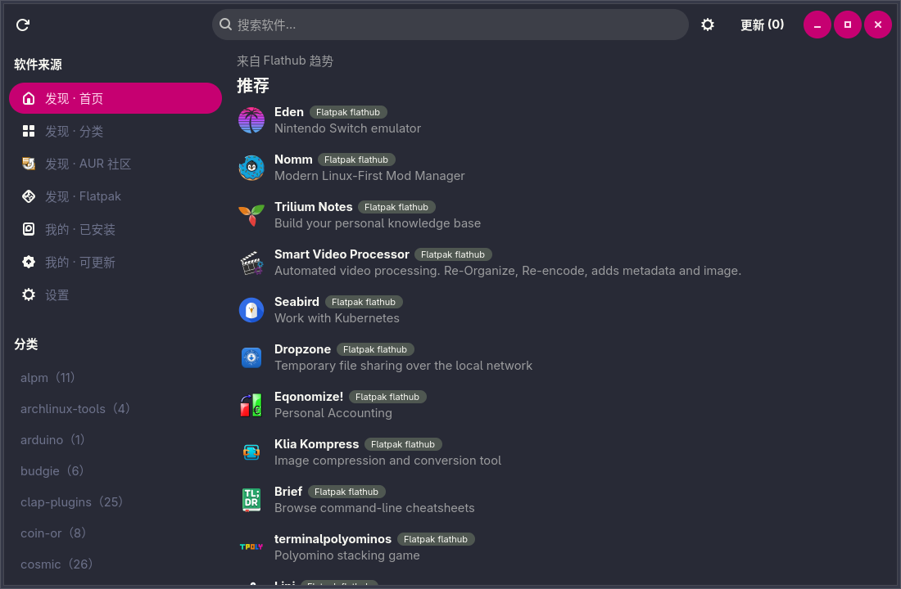
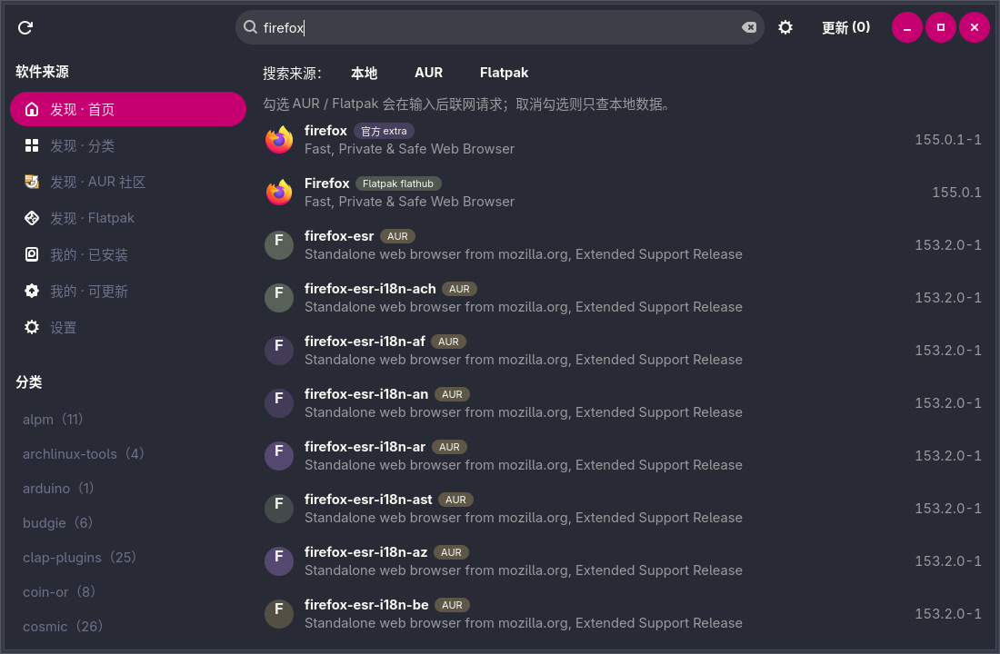

# ArchStore

**Arch Linux 图形化软件商店**：在一个界面里统一管理 **官方仓库（pacman / libalpm）**、**AUR** 与 **Flatpak**。
每一次安装、更新、卸载都先变成一份**可审阅的计划**，再交给唯一一个 root 进程执行。

| 首页推荐（Flathub 趋势） | 搜索（官方仓库 / AUR / Flathub 合并） |
| --- | --- |
|  |  |

> 界面以简体中文为主（gettext，含 zh_TW），软件名支持中文映射表。
> 当前版本 **v0.1.0**：只读查询、事务计划与提权执行全部跑通；**289 个测试全绿**。

## 特性

- **三源统一搜索**：官方仓库（libalpm）、AUR（RPC v5）、Flathub 一次查完，结果按匹配度合并排序；
  来源开关默认**只查本地数据**，勾选后才联网。输入停止约 300 ms 自动搜索，
  **来源开关勾选变化立即用当前关键字重跑**（不必再按回车）。
  **每个来源独立并发、谁先回来谁先上屏**：本地库几乎立刻可见，不等联网来源。
- **计划式事务**：不存在"点击即静默执行"。先出计划清单（计划栏 → 计划详情 → 执行），
  再经 polkit 提权交给 helper 执行，全程有 JSON 事件流与进度面板。
- **绝不 root 跑 GUI**：GTK 与 tokio 永远以普通用户运行，唯一的提权通道是 `archstore-helper`
  二进制，且只接受"计划文件路径 + 计划类型"。
- **尽可能真实的软件图标**：AppStream 数据包 + 已安装包自己的 `.desktop` + Flathub 图标 URL，
  都拿不到时才退化成字母头像（详见[软件图标从哪里来](#软件图标从哪里来)）。
- **失败可用**：任一后端不可用时其余功能完整可用，界面给出原因与修复建议；
  没有 paru/yay、没有 flatpak 也能正常使用。
- **可离线启动**：断网时照常启动、可查已安装、可读缓存（缓存命中时搜索结果也能离线查看）。

## 目录

- [设计原则（可检验）](#设计原则可检验)
- [架构](#架构)｜[事务安全模型](#事务安全模型)
- [安装](#安装)
- [使用](#使用)｜[软件图标从哪里来](#软件图标从哪里来)
- [质量保障](#质量保障)
- [性能](#性能)
- [已知取舍与实测发现](#已知取舍与实测发现)
- [已验证 / 未验证](#已验证--未验证)
- [参与贡献](#参与贡献)
- [许可证](#许可证)

## 设计原则（可检验）

| 原则 | 在本项目中的体现 |
| --- | --- |
| 透明可控 | 不存在"点击即静默执行"的按钮；执行前必然出现计划清单（计划栏 → 计划详情 → 执行） |
| 绝不 root 跑 GUI | GTK 与 tokio 永远以普通用户运行；所有提权操作只经过 `archstore-helper` 一个二进制 |
| 主线程零阻塞 | 主线程只做 UI；libalpm 由独占线程处理，网络与子进程走 tokio |
| 显式联网 | 搜索栏有来源开关；默认只查本地数据 |
| 失败可用 | 任一后端不可用时其余功能完整可用，UI 给出原因与修复建议 |
| 可离线启动 | 断网时应用照常启动、可查已安装、可读缓存 |

## 架构

~~~
archstore-gui  ──►  archstore-core  ◄──  archstore-helper
     (GTK4)           (无 GUI 依赖)          (root，无 GUI)
~~~

- **`archstore-core`**：统一数据模型、三后端（pacman / AUR / Flatpak）、自研文件缓存、
  配置、网络层、环境自检、事务计划。**不依赖 gtk4**（`make check` 用 `cargo tree` 强制）。
- **`archstore-gui`**：GTK4 + libadwaita 界面，二进制名 `archstore`。
- **`archstore-helper`**：唯一以 root 运行的进程，只接受"计划文件路径 + 计划类型"。

### 事务安全模型

GUI 与 root 之间**唯一的数据契约**是 `TransactionPlan`（JSON）：

1. GUI 把计划写成 `$XDG_CACHE_HOME/archstore/plans/*.json`（目录 0700、文件 0600）。
2. `pkexec /usr/lib/archstore/archstore-helper --plan <path> --kind <kind>`。
3. helper 自己重新校验：路径白名单 + 属主 + 权限 + `O_NOFOLLOW`、每个包名过白名单、
   重新向系统确认包存在、用 libalpm `check_deps` 独立重算依赖。
4. **校验失败即拒绝全部**，退出码非 0，不执行任何子命令。

绝不通过命令行把包名列表交给 root；绝不使用 `sh -c`；所有子进程用参数数组调用。

## 安装

### 依赖

| 组件 | 最低要求 | 说明 |
| --- | --- | --- |
| 发行版 | Arch Linux 及其衍生 | 启动时自检，非 Arch 直接拒绝启动并给出提示 |
| gtk4 | >= 4.18 | 与 gtk4 0.11 + v4_18 feature 对应 |
| libadwaita | >= 1.8 | 与 libadwaita 0.9 + v1_8 feature 对应 |
| pacman / libalpm | libalpm >= 15 | 只读查询不需要 root |
| rust | >= 1.92 | Edition 2024 |
| polkit / pkexec | 运行时必需 | 提权唯一通道 |
| flatpak | >= 1.14（可选） | 未安装则 Flatpak 源整体置灰 |
| paru 或 yay | 任一（可选） | 两者都无则 AUR **安装**功能置灰（查询不受影响） |
| archlinux-appstream-data | 可选但强烈建议 | 官方仓库软件的图标与截图来源 |

### 从源码构建

~~~bash
git clone https://github.com/koiflan-514/ArchStore.git
cd ArchStore
make build                            # cargo build --release --workspace
./target/release/archstore --doctor   # 只读环境自检，退出码 = 失败项数量
./target/release/archstore            # 启动图形界面
~~~

### 安装到系统

~~~bash
sudo make install        # 安装到 /usr；helper 落在 /usr/lib/archstore/
~~~

或者使用仓库内的 PKGBUILD 打包：

~~~bash
cd packaging && makepkg -si
~~~

安装产物：`/usr/bin/archstore`、`/usr/lib/archstore/archstore-helper`、desktop 文件、
AppStream metainfo、polkit policy、gschema、zh_CN / zh_TW 翻译与软件名映射表。

## 使用

### `--doctor`：先确认环境

`archstore --doctor` 逐项报告：发行版、gtk4/libadwaita 运行期版本、libalpm 可读性、
各同步库是否同步、polkit/helper 是否就位、flatpak 远程仓库、AUR 助手、
**软件图标来源**（AppStream 覆盖的仓库包数 + 已安装包 `.desktop` 图标数）、缓存目录。
`--doctor --json` 输出同内容的 JSON（便于脚本消费）。

**自检是只读的**：不注册任何动作、不写 `/var/lib/pacman`、不触发下载。

### 快捷键

| 快捷键 | 作用 |
| --- | --- |
| `Ctrl+F` | 聚焦搜索框 |
| 直接输入 | 停止输入约 300 ms 后自动搜索（勾选了 AUR / Flatpak 才会联网） |
| `Enter` | 立即执行搜索（不必等防抖） |
| 来源开关 | 勾选/取消后**立刻**用当前关键字重跑 |
| `F5` | 刷新已安装与可更新列表 |
| `Ctrl+,` | 打开设置 |
| `Esc` | 先返回上一页，其次清空搜索框 |
| `Alt+←` | 返回上一页 |

### 软件图标从哪里来

| 优先级 | 来源 | 覆盖范围 | 前置条件 |
| --- | --- | --- | --- |
| 1 | AppStream 数据包（`archlinux-appstream-data`）的缓存图标文件 | 实测 1259/15252 个仓库包（8.3%） | 可选数据包 |
| 2 | 已安装包自己的 `.desktop` 里的 `Icon=` | 已安装的 GUI 软件（**AUR 也在内**） | 无 |
| 3 | Flatpak / Flathub 的图标 URL（异步下载，按内容哈希落盘，URL→路径映射 30 天） | 首页推荐、Flatpak 分类与搜索、已安装的 Flatpak | 联网 |
| 4 | 主题里与包名/应用 ID 同名的图标 | 少数包（mpv、btop…） | 无 |
| 5 | 字母头像（首字母 + 稳定配色） | 其余全部 | 无 |

- 优先级 3 下载完成后会**原地回填**已经渲染出来的行（`RowContext::slots` 弱引用槽位）——
  `GtkListView` 的 factory 只在 bind 时创建控件，只写内存缓存不会触发重绘。
- **未安装的 AUR 包没有任何本地元数据**（AUR RPC 不提供图标），因此仍然显示字母头像 ——
  这是数据源的硬限制，不是解析缺陷。
- 覆盖率可在本机复现：`cargo run -p archstore-core --release --example icon-report`。

## 质量保障

~~~bash
make check    # fmt --check + clippy -D warnings + 全部测试 + 依赖方向约束 + msgfmt --check
~~~

当前状态：**289 个测试全绿**（core 189 + 集成 7/9/4 + UI 冒烟 50 + helper 30）。

| 层级 | 内容 |
| --- | --- |
| 单元测试 | 缓存（TTL/原子写/损坏自愈/LRU）、cache key 编码、包名白名单、计划 serde 往返与前向兼容、配置迁移与未知字段保留、事务状态机转移、依赖表达式解析、图标索引（AppStream 文件名消歧 / `.desktop` 解析 / 图标优先级） |
| 契约测试 | `flatpak -j` 的 C locale 与中文 locale 两份固件、Flathub appstream/summary/collection 真实响应、安全公告的 null 字段 |
| 集成测试（只读） | `AlpmWorker` 在本机真实数据库上打开/搜索/反依赖/`check_deps` |
| 网络冒烟 | 同一个 `reqwest::Client` 打通 AUR 与 Flathub（TLS provider 冲突回归测试）；在线翻译端到端在 MyMemory 免费日配额用尽时**跳过**而不是判失败（外部服务限制） |
| UI 冒烟 | `src/smoke.rs`：在 headless GTK 下构造**每一个页面与控件**（列表行/详情/截图槽位/依赖/计划栏/进度面板/设置页/三态外壳/ListStore 增量更新/状态机联动/远程图标回填）；无显示服务器时优雅跳过 |
| 启动冒烟 | `xvfb-run ./target/release/archstore` 运行 15 秒：断言退出码为超时（进程存活）、无 `CRITICAL`、无 `last-crash.txt` |

## 性能

延迟与复杂度由 `crates/archstore-core/tests/perf.rs` 守着（release 实测，x86_64）：

| 操作 | 耗时 | 说明 |
| --- | --- | --- |
| alpm worker 冷启动 | 175 ms | 打开句柄 + 注册 core/extra（**15252 个包**）；§12 的预算是不含注册的"extra 首次遍历 < 300 ms" |
| └ 其中图标索引 | +30 ms | AppStream 图标目录 1 ms + 已安装包 `.desktop` 索引 28 ms（**必须计入冷启动**：否则首个请求替启动买单，Installed 会从 9 ms 变成 53 ms） |
| Installed（974 包，含建本地索引） | 9.4 ms | 首次 |
| Installed（热缓存） | 1.6 ms | 本地索引生效 |
| Upgradable | 0.66 ms | libalpm `vercmp` 逐个比对 |
| Search（core+extra） | 8.0 ms | `db.search` |
| Groups（107 个包组） | 2.1 ms | 分类页数据源 |
| Info（含 check_deps） | 0.42 ms | |
| RevDeps(glibc) | 1.8 ms | **705 条**，与设计文档实测值一致 |
| 单次缓存读取 | 4.5 µs | 内存索引 + 小文件 |
| 排序 5000 条 | 0.96 ms | UI 线程上执行 |
| 合并去重 5000 条 | 10.2 ms | 修复前 239 ms（见下） |

GUI 侧（`src/smoke.rs` 内实测，debug 构建即已满足）：

~~~
千级列表：填充 2000 条 3.2ms｜无变化 1.26ms｜改 1 条 0.94ms｜追加 10 条 0.90ms
         截断 10 条 1.10ms｜首条变化(全量) 3.58ms｜渲染 200 行 16.5ms（每行 0.082ms）
~~~

常驻内存（`scripts/measure-memory.sh`，Xvfb 下两种渲染后端各测一次）：

| 渲染后端 | VmRSS | **Pss** | 峰值 | CRITICAL |
| --- | --- | --- | --- | --- |
| `cairo` | 217 MB | **127 MB** | 223 MB | 0 |
| `gl` | 357 MB | **158 MB** | 357 MB | 0 |

- **Pss 是公平口径**（按共享比例分摊），两项都低于 §12 的 200 MB 预算。
- VmRSS 把 gtk4 / libadwaita / mesa / 字体的共享页整份计入本进程，对 GTK 应用天然偏高。
- `gl` 的数值被 Xvfb 的 **llvmpipe 软件光栅化**拉高（显存缓冲落在匿名内存），真实 GPU 环境会更低。
- `src/smoke.rs` 的千级列表测试与 `perf.rs` 的复杂度护栏（规模翻倍 < 3×）共同防止 UI 线程退化。

## 已知取舍与实测发现

> 这一节记的都是"能编译、能过单元测试，但运行时才坏"的真实缺陷与上游怪癖，欢迎当作踩坑索引。

### 平台与上游接口

- **TLS provider**：进程内只创建一个 `reqwest::Client`，并注入
  `raur::Handle::new_with_settings`。混用两个客户端会触发 rustls 的
  "no process-level CryptoProvider" 风险。
- **`register_syncdb_mut` 对不存在的库返回 Ok**：因此仓库可用性用三条件判定
  （pacman.conf 段名 ∧ `/var/lib/pacman/sync/<name>.db` 非空 ∧ `pkgs().len() > 0`）。
- **`check_deps` 反依赖检查必须把全体已安装包放进 `pkgs`**，否则静默返回 0（漏报）。
- **flatpak 输出必须 `LC_ALL=C`**：中文 locale 下 `-j` 的 JSON 键名会被本地化成
  "应用程序_id" 等，解析会随机失败。
- **`flatpak remotes` 没有 `installation` 列**（`--columns=installation` 直接报错），
  需分别查询 `--system` / `--user`。
- **Flathub 集合分页必须同时传 `page` 与 `per_page`**，只传其一返回 HTTP 400。
- **`security.archlinux.org/issues/all.json` 有 null 字段**（实测 2444 条中
  2239 条 `ticket` 为 null、202 条 `fixed` 为 null），必须容忍。
- **ODRS 评分接口不稳定**：3 秒超时 + 静默降级为"无评分"，不阻塞详情页。
- **`cowsay` 已从 AUR 迁入官方 extra 仓库**（`pacman -Si cowsay` 有结果、
  AUR RPC 返回 0 条），因此设计文档阶段 4 以它作为 AUR 验收样例已不再适用。
- **helper 依赖 archstore-core**，因此会链接 core 的全部依赖（含网络栈）。
  helper 自身从不调用网络代码，且不依赖 gtk4/libadwaita。

### 运行时才暴露的缺陷

- **启动即崩/静默错乱的四个真实缺陷**：
  1. `RefCell::clone()` 复制的是**内容**而不是共享句柄。分类页的
     `categories`/`current`/`offset` 与搜索页的 `last_query` 曾被信号闭包
     各持一份副本，导致分页参数永远为 0、"加载更多"必然失败。已改为 `Rc<RefCell<…>>`。
  2. `AdwPreferencesGroup` 的子控件不是 `GtkWidget` 的直接 child，
     用 `first_child()` 遍历再 `remove()` 会触发 `Adwaita-CRITICAL`。
     后端状态列表改为自己记录动态加入的 `AdwActionRow`。
  3. **同一个控件被 add 到 ViewStack 两次**："AUR 社区"与"Flatpak"曾复用首页/搜索页的
     `AdwToastOverlay`；GTK 中一个控件只能有一个父容器，运行时刷
     `GLib-GObject-CRITICAL: g_object_ref_sink…` 且页面不可用。
     改为两个导航项**复用分类页并按来源过滤**（顺便得到"AUR 社区只显示 AUR 关键词分类"）。
  4. **排序键把流行度与票数塞进了同一个整数**：`-(popularity*1000) - votes` 使得
     票数可以压倒流行度（真实 AUR 数据上出现 1.053/800 票排在 1.086/10 票之前）。
     改为分级比较器：匹配等级 → 流行度(f64 降序) → 票数(降序) → 名称(升序，保证全序)。
- **合并去重曾是 O(n²)**：`merge_results` 用 `Vec<PackageId>` 做线性去重，
  5000 条实测 239 ms（是排序的 26 倍），在 UI 线程上直接掉帧。改用 `HashSet` 后降到
  release 10.2 ms。`perf.rs` 用"规模翻倍耗时 < 3×"的复杂度护栏锁住这个性质
  （不受 debug/release 差异影响）。
- **崩溃恢复需要"已完成"标记**：只判断"计划文件存在"会让横幅每次启动都出现。
  现在事务成功后写入 `plans/last.done`，仅当计划文件比标记新时才提示。
- **计划摘要的动词必须看计划类型**：端到端实测时发现卸载计划的摘要写成了
  "安装 sl"（`TransactionPlan::push` 只看 `reason` 不看 `kind`），
  已修正为按 `kind.is_remove()` 选择动词，并加了单元测试。
- **`gtk-application-prefer-dark-theme` 的 Adwaita 警告来自用户环境**：
  本机 `~/.config/gtk-4.0/settings.ini` 设了该键，libadwaita 会提示改用
  `AdwStyleManager:color-scheme`。本项目本来就用后者，代码无需改动。

### 用户实测反馈的界面缺陷

- **"鼠标悬停就打开详情页"**：原因是把 `GtkSingleSelection::selected-notify`
  当成了"用户点击"信号。`GtkListView` 的 `single-click-activate` 属性语义是
  **"Activate rows on single click and select them on hover"** ——
  悬停本身就会改变 `selected`，于是鼠标一划过就触发了打开详情。
  `selected` 表达的是"选中态"（悬停、键盘焦点都会变），`GtkListView::activate`
  才是"用户动作"。已改用 `connect_activate`，并在 `smoke.rs` 加了回归测试：
  程序化改变 selected 不得打开详情页，只有 activate 信号才会。
  同类控件里只有列表用错了信号，`DropDown` / `ComboRow` 的 `selected` 变化确实等于用户选择，保持原样。
- **搜索结果页从未被注册进 ViewStack**：`run_search` 把结果写进了一个**用户看不见的页面**——
  搜索看起来"没反应"。现在搜索页注册为 `"search"`，搜索时先 `pop_to_tag("root")` 再切页。
- **空态会吞掉搜索来源开关**：`PageShell` 用 `GtkStack` 切换加载/空/错/内容四态，
  而来源开关原本被放在 `shell.content` 里，于是"没有找到匹配的软件"把整个开关行一起替换掉了。
  现在 `SearchPage.root = [来源开关（常驻）] + [结果区（三态）]`，
  并加了结构性断言：开关**不在** `PageShell` 的 stack 之内。
- **同一个坑在"已安装"页又踩了一次**（用户实测反馈）：在"已安装"的筛选框里输入一个本机
  不存在的软件名，列表变空的同时**整个筛选栏（搜索框 + 状态下拉框 + 计数）都被空态替换掉**，
  用户再也改不回筛选条件。根因不是这一页写错了，而是 `ListPage::new` 把传入的 header
  放进了 `shell.content` —— 于是**所有**列表页的表头都会随空态消失（可更新页的
  "一键更新"按钮、首页的数据来源说明同理）。
  现在 `ListPage.root = [表头（常驻）] + [PageShell]`，窗口注册 `page.root`，
  表头永远在 stack 之外；同时把"两种空"分开说：数据本身为空 vs 只是筛选没命中
  （后者提示"换个关键字或切回全部"，不再误报成"读不到本地数据库"）。
  `smoke.rs` 加了结构性回归：筛选到 0 条时搜索框/下拉框仍在，且搜索框**不是**
  `PageShell.stack` 的后代；清空搜索后必须恢复全量列表。
- **搜索的"限制"不是实时生效**（用户实测反馈）：设计文档写着"防抖 300 ms"，
  但输入框的回调只是把进度条点亮，**真正的搜索只在按回车时才发生**；
  来源开关里**只有"本地"接了重跑**，勾掉或勾上 AUR / Flatpak 完全没反应；
  清空输入框也不会清掉上一次的结果。
  现在三条触发路径都汇到同一条 `run_search`：输入 300 ms 防抖后自动搜索、
  任一来源开关变化立即重跑、清空输入立刻回到提示态；过期响应仍由
  `SearchPage` 的 generation 丢弃（`smoke.rs` 覆盖"输入必须推进代号"与"清空必须清结果"）。
  顺带把 `GtkSearchEntry` 自带的 150 ms `search-changed` 延迟归零，
  否则会和我们的防抖叠加成 450 ms。
- **单来源也要等最慢的那个来源**（用户实测反馈："等待时间过长"）：
  `run_search` 以前是 pacman → AUR → Flatpak **顺序 await**、全部返回后才一次性合并显示，
  于是本地库几毫秒的结果也要被联网来源拖住。
  现在每个来源各自 `spawn`、**谁先回来谁先上屏**（`merge_results` 逐次重排），
  未勾选的来源完全不发请求；AUR 搜索 5 分钟、Flathub 6 小时的 core 层缓存照常命中，
  本地库通常首帧就有结果。还有来源在路上时不会先下"没有找到"的结论（保持加载态）。
- **来源开关选中后没有高亮色块**（用户实测反馈）：三个开关都带 `.flat`，
  而 flat 按钮在选中态也没有背景，勾没勾上看不出来。
  加了 `button.source-toggle:checked` 的强调色规则后**仍然看不到** —— 排查发现
  本机 `~/.config/gtk-4.0/gtk.css` 是 Noctalia 的 Material You 主题（25 KB，
  自带 `button:checked` 与 `@define-color accent_bg_color #bd93f9`），它以
  `GTK_STYLE_PROVIDER_PRIORITY_USER`(800) 加载，而我们的 CSS 用的是
  `STYLE_PROVIDER_PRIORITY_APPLICATION`(600) —— **整个 app 样式被用户主题盖掉**
  （只有主题里不存在的类，如 `.avatar-*`，看起来"正常"，掩盖了这个问题）。
  修复：`ui::load_css` 改用 `STYLE_PROVIDER_PRIORITY_USER`，我们更具体的
  `button.source-toggle:checked` 稳定胜出；`smoke.rs` 断言开关必须带
  `source-toggle` 且不得带 `flat`。
  > 教训：**自定义 CSS 的"生效"必须用像素验证**，不能只看类名/结构断言 ——
  > 结构全对、样式被主题吃掉时，界面照样是"没反应"。
- **"我的 · 已安装"的状态下拉框不实时生效**（用户实测反馈）：
  `set_filter_index` 只改了筛选状态、没有重新应用，选完分组列表纹丝不动，
  要等下一次在搜索框里打字才刷新。现在下拉框变化立即重新过滤；
  本地过滤同时把 `GtkSearchEntry` 的 150 ms 延迟归零。
  `smoke.rs` 新增断言：`set_filter_index(可更新)` 后 `visible_count()` 必须当场变化。
- **"发现"的三个入口来回切换不更新**（用户实测反馈）："分类 / AUR 社区 / Flatpak"
  三个导航项复用同一个分类页（GTK 中一个控件只能有一个父容器，不能把同一页面
  反复 add 到 ViewStack），于是它们**共享"当前选中的分类"**：在"分类"里点开 gnome，
  切到"AUR 社区"看到的仍是 gnome 的软件列表，而且切回来也不会重新请求。
  现在 `CategoryPage` 为每个来源保存独立会话（`switch_source`）：保存旧来源的选择 →
  按来源过滤侧栏分类 → 恢复新来源的选择 → **重新拉取该分类的首屏**
  （本地库毫秒级、AUR/Flathub 命中缓存）；该来源还没选过分类时显示
  "请从左侧选择一个分类"，**绝不残留上一个来源的列表**。切到"首页"同样会重新拉取
  Flathub 趋势（6 小时缓存命中时几乎瞬时）。`smoke.rs` 覆盖"各来源各自记住分类"
  与"新来源必须返回 None 而不是沿用上一个分类"。
- **详情页没有返回键**：`AdwNavigationView` 只会往"页面里的 `AdwHeaderBar`"注入返回键，
  而详情页根控件原本是裸的 `GtkBox`。已包成 `AdwToolbarView + AdwHeaderBar`，
  并补了 `Esc`（先返回列表）与 `Alt+Left` 快捷键。回归测试用递归查找确认
  `AdwHeaderBar` 真的存在（`AdwToolbarView` 的内部子控件不是 `first_child`，不能用它断言结构）。
- **点击侧栏不切页**：从详情页点侧栏时，详情页仍压在导航栈上，看起来"点了没反应"。
  现在任何侧栏点击都先 `nav_view.pop_to_tag("root")`。
- **"很多软件没有图标"有四个独立根因，全部修掉**：
  0. **首页"推荐"自己构造摘要，漏掉图标 URL**：`load_home` 把 Flathub 集合响应
     手工转成 `PackageSummary` 时没有搬 `icon` 字段，于是 40 条推荐**全部**是
     `IconRef::Missing` —— 这是首屏最显眼的那一屏，用户看到的就是"一屏字母头像"。
     现在统一走 `FlatpakBackend::hits_to_summaries`（并加了
     `collection_hit_summary_keeps_remote_icon` 回归测试锁住图标 URL）。
  1. **已下载的远程图标从不回填界面**：`GtkListView` 的 factory 只在 bind 时创建控件，
     而旧实现下载成功后**只写内存缓存**，已经渲染出来的行不会重绘 —— 首页"推荐"
     （全部来自 Flathub 的远程图标）于是从头到尾都是字母头像，直到滚动把行移出屏幕再滚回来。
     现在占位控件会被登记为弱引用"槽位"（`RowContext::slots`），下载完成时**原地替换**，
     同一个包在多个页面同时出现也只发一次请求（`smoke.rs` 有回归测试）。
  2. **AUR 与"AppStream 里没有"的仓库软件没有本地图标来源**：实测本机 15252 个仓库包
     只有 1259 个（8.3%）在 archlinux-appstream-data 里有图标，AUR 包则一个都没有；
     hicolor 主题里"与包名同名"的图标只有 13 个。现在从 **libalpm 本地库的文件清单**
     （即 `pacman -Ql` 的数据源）找出每个**已安装**包的 `.desktop` 并解析 `Icon=` ——
     不需要 root、不需要联网。实测 974 个已安装包耗时 **28 ms**，46 个包因此拿到图标，
     其中 5 个是 AUR 外来包（google-chrome / wps-office-cn / wemeet-bin /
     intellij-idea-ultimate-edition / zcode-bin），而它们在修复前一律是字母头像。
  3. **`IconRef::IconName` 里的图标名被忽略**：GUI 一律拿**包名**去查主题图标，
     于是 `.desktop` 里 `Icon=code-oss` 这类信息被白白丢掉。
     现在优先用图标名本身，包名只作为后备。
- **AppStream 图标文件名会张冠李戴**：文件名布局是 `<包名>_<appid>.png`，
  而**包名与 appid 都可能含下划线**（`jack_mixer_jack_mixer.png`、
  `celluloid_io.github.celluloid_player.Celluloid.png`）。按第一个下划线切分会把
  `jack_mixer` 的图标挂到 `jack` 包上。现在把 libalpm 的包名集合传进索引，
  取"最长的、确实存在的包名前缀"，两类文件名都能正确归属。
- **图标/截图缓存**：图标文件按内容哈希命名（天然去重）但无法由 URL 反查，
  因此额外缓存一层 `url -> 本地路径` 映射（TTL 30 天，文件缺失自动失效）。

## 已验证 / 未验证

**已验证（本机实测）**

- `cargo build --release --workspace`、`cargo clippy -- -D warnings`、`cargo fmt --check`、
  **289 个测试全绿**（core 189 + 集成 7/9/4 + UI 冒烟 50 + helper 30）
- `--doctor` 输出与设计文档基线逐项一致（local 972 包 / explicit 185 / core 297 / extra 14955），
  并新增图标来源一项：`[ OK ] 软件图标：AppStream 覆盖 1260 个仓库包；46 个已安装包另有 .desktop 图标（含 AUR 软件）`
- **图标修复的端到端验证**（Xvfb 下运行 release 二进制 + XTEST 注入真实键入）：
  首页"推荐"从"一屏字母头像"变成真实彩色图标（Flathub 集合接口的 40 条全部下载落盘，
  实测新增 56 个图标文件；用像素统计核对：首页图标格 82–299 种颜色/饱和度 12–69，
  而未安装 AUR 结果仍是 10–64 种颜色/饱和度约 13 的字母头像）；
  搜索 `chrome` 命中的三个**未安装 AUR 包**保持字母头像 —— 它们确实没有任何本地图标来源。
- 只读后端打通真实数据：AUR 搜索+详情+依赖、Flathub 元数据+分类分页（第 1/2/3 页内容不重复）、
  Flatpak 本地列表、Arch 安全公告（2444 条，首次 2.5 s、缓存命中 25 ms）
- helper 拒绝全部注入尝试（路径穿越、命令注入、白名单外路径、0644 权限、未知 schema、kind 不匹配）
- `make install DESTDIR=… PREFIX=/usr` 产物通过 `desktop-file-validate`、
  `appstreamcli validate`、`glib-compile-schemas --strict`，polkit 的 `exec.path`
  与实际安装路径一致
- GUI 在 `xvfb` 下稳定运行，0 个 `CRITICAL`，无 panic

**真实写事务（已在本机完整跑通）**：`sudo make install` 后，
用 `cargo run --example make-plan`（**真实的计划构建代码**，非手写 JSON）
生成计划，再经 `pkexec` 交给 helper 执行：

| 步骤 | 结果 |
| --- | --- |
| `--dry-run` 校验 | `已确认软件包 sl / 依赖自检：本地已满足全部依赖 / [dry-run] 将执行：pacman -S --noconfirm --needed -- sl` |
| 安装 `sl`（10.6 KiB） | 29 个 JSON 事件，`done status=ok installed=1`，**997 ms** |
| 事件流阶段映射 | `download → keyring → verify → conflict → install` 全部命中 |
| 校验安装结果 | `pacman -Q sl → sl 5.05-6`，包数 972 → 973 |
| 卸载 `sl` | `pacman -Rns --noconfirm -- sl`，**151 ms**，包数回到 **972** |
| 回滚确认 | `pacman -Q sl` 报未找到，`/usr/bin/sl` 已删除，无残留 |
| 锁冲突 | 手工放 `/var/lib/pacman/db.lck` 后 helper 以 `{"code":"LOCKED"}` 拒绝，退出码 1 |
| `pkaction --verbose` | action 已注册，`exec.path` 与 `allow_gui=false` 注解正确 |

**安全测试（16 项，全部拒绝且系统未被改动）**：白名单外路径 / 不存在的文件 / 相对路径 /
权限 0644 / **root 属主（调用者 uid=1000）** / 符号链接指向 `/etc/passwd` /
包名路径穿越 / 包名命令注入（`;`、`$(id)`）/ 包名伪装成选项（`--noconfirm`）/
不存在的包 / 未知 schema / `--kind` 与计划类型不符 / 卸载未安装的包 / 非法 JSON /
未知 `--kind` 取值 / 未知参数。

**未验证**

- **AUR 助手的实际构建**：需要 TTY 与 sudo 密码，且会在用户身份下编译软件包；
  本机只验证到"构造参数数组 + 打开终端 + 无法打开终端时复制到剪贴板"这一层。
- **Flatpak 写事务**：需要 flathub 远程可写与本机安装位置，未执行。
- **在真实 GPU 上的渲染性能**：本机无头环境只能测到 llvmpipe 软件光栅化。

## 范围

v0.1.0 明确**不做**：系统包与 Flatpak 的同一软件去重合并、依赖树图形控件、
评论/评分写回、AUR makepkg 流程（全部交给助手）、AppImage / Snap / 自定义仓库。

## 参与贡献

- 提交前请跑一遍 `make check`（格式、clippy、测试、依赖方向、翻译检查一次过）。
- 缺陷请附上 `archstore --doctor` 的输出与 `$XDG_CACHE_HOME/archstore/archstore.log`；
  崩溃时还会额外写出 `last-crash.txt`。
- 界面文案统一走 gettext：`make pot` 抽取、`make mo` 编译。

## 许可证

**GPL-3.0-or-later**（GPL v3 或更高版本），全文见 [LICENSE](LICENSE)。

**注意**：`alpm` / `alpm-sys` 是 **GPL-3.0**（非 -or-later）且被静态链接，
因此分发时必须在 README 与"关于"页声明包含该组件。本项目选择 GPL-3.0-or-later 与之兼容。
`raur` 是 MPL-2.0（文件级 copyleft，不传染）。
